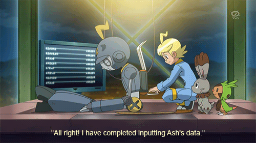

<p align="center">
  
</p>

<div align="center">

# Learn LLMs From Scratch

### Build, Understand, and Reproduce Modern Large Language Models

A comprehensive educational repository for studying the mathematics, implementation, and research behind modern Large Language Models (LLMs).


</div>

---

## Overview

This repository is a structured learning resource for understanding modern Large Language Models from first principles.

The project follows the complete journey from mathematical foundations to implementing transformer architectures, reproducing influential research papers, and conducting original experiments.

Rather than treating LLMs as black boxes, every major component is studied, implemented, and explained.

---

## Learning Path

```
Mathematics
      ↓
Python & PyTorch
      ↓
Tokenization
      ↓
Embeddings
      ↓
Self-Attention
      ↓
Transformers
      ↓
Training
      ↓
Modern LLM Components
      ↓
GPT & Llama
      ↓
Research Papers
      ↓
Original Experiments
```

---

## Repository Structure

```text
00 Foundations
01 Tokenization
02 Embeddings
03 Self-Attention
04 Multi-Head Attention
05 Transformer Block
06 Transformer
07 Training
08 Inference
09 Modern LLM Components
10 Architectures
11 Papers
12 Experiments
```

---

## Documentation

| Document | Description |
|----------|-------------|
| 📖 [ROADMAP.md](ROADMAP.md) | Complete learning roadmap |
| 📄 [PAPERS.md](PAPERS.md) | Research paper roadmap |
| 📚 [REFERENCES.md](REFERENCES.md) | Textbooks, papers, and learning resources |

---

## Prerequisites

Basic familiarity with:

- Python
- Calculus
- Linear Algebra

For the full curriculum, see **[ROADMAP.md](ROADMAP.md)**.

---

## Installation

### Clone

```bash
git clone https://github.com/<your-username>/learn-llms-from-scratch.git
cd learn-llms-from-scratch
```

### Conda (Recommended)

```bash
conda env create -f environment.yml
conda activate llms-from-scratch
```

### Or using pip

```bash
python -m venv .venv

# macOS / Linux
source .venv/bin/activate

# Windows
.venv\Scripts\activate

pip install -r requirements.txt
```

---

## Repository Philosophy

Every topic in this repository follows the same progression:

1. Learn the theory.
2. Understand the mathematics.
3. Implement the concept from scratch.
4. Connect it to influential research papers.
5. Reproduce published experiments where feasible.
6. Explore extensions through original experiments.

The objective is not only to understand existing language models, but also to develop the skills required to read, reproduce, and eventually contribute to LLM research.

---

## Inspiration

This repository has been inspired by educational projects including:

- Sebastian Raschka — *Build a Large Language Model (From Scratch)*
- Andrej Karpathy — *nanoGPT*
- Andrej Karpathy — *llm.c*
- Fareed Khan — *train-llm-from-scratch*
- Hugging Face — *Transformers*

---

## License

Released under the MIT License.
